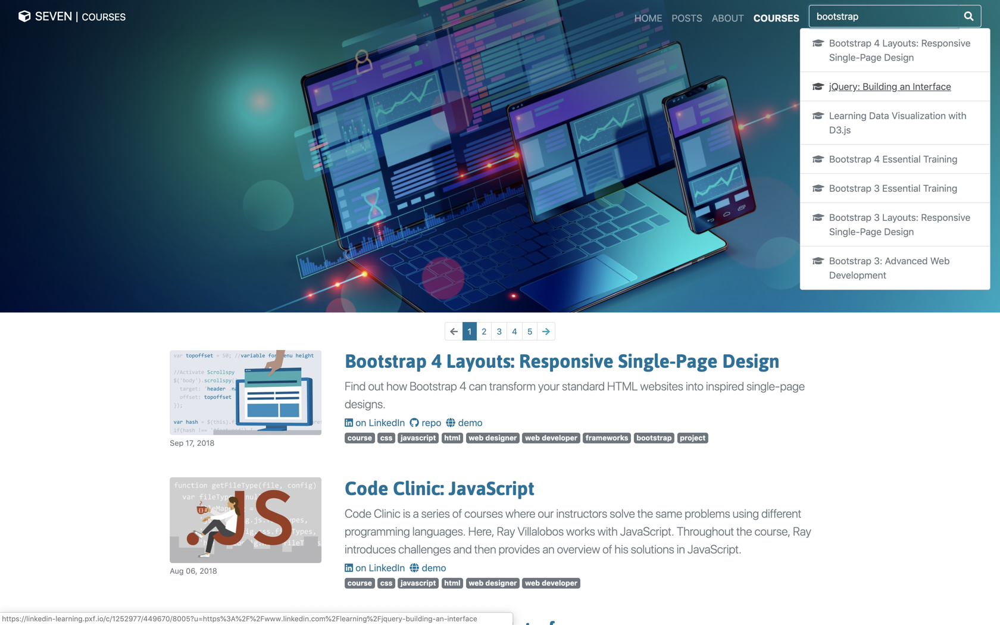

# Seven

[](https://seventy.now.sh)

This project is a template for building sites using the [Eleventy](https://www.11ty.io/) static site generator. You can see a demo of the site at [7ty.tech](https://7ty.tech). It features a Vue.js powered simple search based on what's in `_site/posts` and `_site/courses` as well as pagination, animations and more.

## Quickstart

- `Clone` or `download` the repo
- Run `npm install` to install dependencies
- Run `npm start` to start the development server.
- Point your browser to `localhost:8080`
- Edit posts in the `_site/posts` or `_site/courses` folder.
- Run `npm run build` to build the project.

## Styles and Scripts

All the files that require pre-processing are inside the `_process` folder. That includes The Sass as well as the javascript/vue files.

You can edit the style.css file, which has imports to other required css files like `animate.css`, `bootstrap.scss`. There is also a `prism` folder which has all of the stylesheets for prism, which are the styles for syntax highlighting used on the site.

The `js` folder has the main script.js with some jquery code to manage some of the features of the site (the injecting of an `.inbody` class into the nav when you scroll into the main content section, etc.). `app.js` is the entrypoint for Vue.js, which performs a simple search of collections in two folders.

## Site

The main 11.ty site files are all in the `_site` folder.

The `_site` folder is pretty much like your website root folder, but not really. These files will convert to pages for the most part. It's useful to think of it as having the structure your site folder will have (notice there are index, css, image files like on your site), but don't be fooled, most of the files in this folder need to be processed.

The `_templates` folder is pretty much what it sounds like. It has a series of tempaltes used to build your site, no content here. Most of these are self explanatory and you'll see these being called in your pages. There is a `_layouts` folder that has the main layouts. You should probably look at the 11.ty documentation to learn how these work.

There is a special getTagsList.js folder which sets up your tags, It's used by the main configuration file called `.eleventy.js`. I didn't know where else to put it so it seemed like a good idea to me.

- `_data` folder
  This has the `metadata.json` file, which includes variables that the site uses to build itself. Things like name, bio, the title of the site. For example, you can access the title of the site using `{{metadata.title}}` in your template.

## Configuration

The main configuration file is called `.eleventy.js` and is in the root folder. The important bits are the special collections based on existing folders.

```js
// only content in the `posts/` directory
eleventyConfig.addCollection("posts", function(collection) {
  return collection.getFilteredByGlob("./_site/posts/*.md").reverse();
});

// only content in the `posts/` directory
eleventyConfig.addCollection("courses", function(collection) {
  return collection.getFilteredByGlob("./_site/courses/*.md").reverse();
});

eleventyConfig.addCollection("searchable", function(collection) {
  return collection
    .getFilteredByGlob(["./_site/courses/*.md", "./_site/posts/*.md"])
    .reverse();
});
```

These commands set up three collections, which are used to build pages. The first two correspond to folders in the `_site` folder, the last one is used for the search. If you want to create additional folders, you can simply add a new collection. Check the 11.ty documentation to learn how to use the `getFilteredByGlob` command.

The last one adds these two folders to a new collection which our `Vue.js` search component uses. If you add a new collection, make sure you add it here.

```
  eleventyConfig.addPassthroughCopy("./_site/images");
  eleventyConfig.addPassthroughCopy("./_site/css");
  eleventyConfig.addPassthroughCopy("./_site/js");
```

This code is used to copy whatever is in these folders, if you happen to move the locations of the css, images or js folders, then update these. Also, these are temporary files that webpack and `node-sass` will generate for us, so don't edit the files in the `js` or the `css` folder, remember to edit scripts and css in the `_process` folder.

I hate messy root folders, so I've reconfigured where eleventy places files.

```js
dir: {
  input: "_site",
  includes: "_templates",
  data: "_data",
  output: "dist"
}
```

If you move stuff around, remember to update these. Also, the build processes refer to some of these locations, so if you move things, remember to update these.

```js
"start": "npm-run-all --parallel dev:*",
"dev:sass-dev": "node-sass --watch _process/scss/style.scss --output-style expanded --source-map true _process/scss/style.scss --output  _site/css/style.css",
"dev:eleventy": "eleventy --serve --quiet",
"dev:webpack": "webpack --watch",

"build": "run-s prod:*",
"now-build": "run-s prod:*",
"prod:del": "rm -rf build",
"prod:sass-dev": "node-sass --output-style compressed _process/scss/style.scss --output build/css/style.css",
"prod:webpack": "webpack --env.production --silent -p --optimize-minimize",
"prod:serve": "eleventy --output=./build"
```

## Building

I have two main processes that can run.

```sh
npm start
```

This runs the dev server, processes sass, runs webpack (which processes js, then Vue Search), then runs `eleventy` and `webpack` in watch mode. If you make any changes to the sass or the js or the markdown files, it will happily reprocess thinsg for you.

```sh
npm run build
```

Creates a new `build` folder, which is what you'd upload to a server. There is an optional now-build process here as well that runs if you are using `zeit.co`

## Other Setup Files

`webpack.config.js` - Configuration for webpack.
`now.json` - Configuration for now, if you use [zeit.co](https://zeit.co).
`.nowignore` - Thing that `now` ignores
